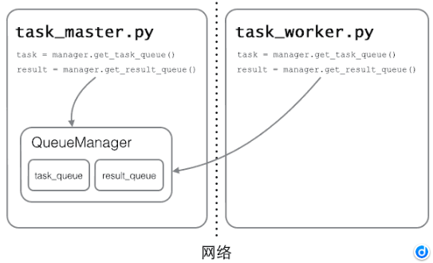

# python 自学笔记
### 变量类型
1. tuple
2. list
3. dict
4. set
5. int、float、str、boolean

### Iterable 和 Iterator
1. 凡是可以for循环的，都是Iterable<br />
凡是可以next()的，都是Iterator
集合数据类型如list，truple，dict，str，都是Iterable不是Iterator，但可以通过iter()函数获得一个Iterator对象<br />
Python中的for循环就是通过next实现的
2. Iterable不是Iterator，Iterator是Iterable

### 函数参数
1. 参数缺省值：`def myFun(arge = ?)`
2. 可变参数：`def myFun(*arge)`。若已经有一个list或tuple时，要调用一个可变参数函数时，可采用如下方式：
```python
num = [1, 2, 3]
myFun(*num)
```
3. 关键字参数`def myFun(arge1, arge2, **arges)`，这表明前两个参数必需，后面其它参数可选。下面示例：
```python
def person(name, age, **kw):
    print('name:', name, 'age:', age, 'other:', kw)

>>> person('Michael', 30)
name: Michael age: 30 other: {}

>>> person('Bob', 35, city='Beijing')
name: Bob age: 35 other: {'city': 'Beijing'}
>>> person('Adam', 45, gender='M', job='Engineer')
name: Adam age: 45 other: {'gender': 'M', 'job': 'Engineer'}

>>> extra = {'city': 'Beijing', 'job': 'Engineer'}
>>> person('Jack', 24, **extra)
name: Jack age: 24 other: {'city': 'Beijing', 'job': 'Engineer'}
```
### 高级特征
1. 切片：`[a:b:c]`，a表示起始下标，b表示终点下标的前一个，c表示“步长”
2. 迭代：`for ... in`。默认下，dict迭代的是key，若要value，可以用`for value in dict.values`，若key和value都要迭代，则`for k, v in d.items()`
<br />
判断对象是否可迭代
```python
>>> from collections import Iterable
>>> isinstance('abc', Iterable) # str是否可迭代
True
>>> isinstance([1,2,3], Iterable) # list是否可迭代
True
>>> isinstance(123, Iterable) # 整数是否可迭代
False
```
3. generator: 一边循环一边计算的机制，称为生成器。**generator保存的是算法，每次调用next(g)，就计算出g的下一个元素的值，直到计算到最后一个元素**
generator创建方法：
```python
# 使用例子
def odd():
    print('step 1')
    yield 1
    print('step 2')
    yield(3)
    print('step 3')
    yield(5)
    
# 通过next()获取值
>>> o = odd()
>>> next(o)
step 1
1
>>> next(o)
step 2
3
>>> next(o)
step 3
5
>>> next(o)
Traceback (most recent call last):
  File "<stdin>", line 1, in <module>
StopIteration

# 通过迭代获取值

#!/usr/bin/env python3
# -*- coding: utf-8 -*-

def triangles():
  array = [1]
  while True:
    yield array
    temp = array
    temp.append(0)
    array = [1]
    index = 0
    while index + 1 < len(temp):
      array.append(temp[index] + temp[index + 1])
      index += 1

if __name__ == '__main__':
  n = 0
  for t in triangles():
    print(t)
    n += 1
    if n == 10:
      break
```
3. 迭代器：指能通过`for ... in`遍历的对象，包括：`list`、`tuple`、`dict`、`set`、`str`、`generator(包括生成器和yield函数)`，这些统称为`Iterable`，可通过如下方式判断：
```python
from collections import Iterable
isinstance(?, Iterable)
```
总结：**`Iterable`**类型——可作用与`for`循环的对象；
**Iterator**类型——可作用于`next()`的对象

### 函数式编程
1. 面向过程：将复杂任务分解成一个个简单的子任务，每个子任务由相应函数实现，即函数就是面向过程程序设计的基本单元
2. 函数式编程：一种面向过程的编程模式，其一个特点是，允许把函数本身作为参数传入另一个函数，还允许返回一个函数

#### 高阶函数
1. `map()`：将传入的函数依次作用到序列的每个元素，并把结果作为新的Iterator返回。<br />
`reduce()`：把一个函数作用在一个序列[x1, x2, x3, ...]上，这个函数必须接收两个参数，reduce把结果继续和序列的下一个元素做**累积计算**
```python
# map()
>>> def f(x):
...     return x * x
...
>>> r = map(f, [1, 2, 3, 4, 5, 6, 7, 8, 9])
>>> list(r)
[1, 4, 9, 16, 25, 36, 49, 64, 81]

# reduce()
>>> from functools import reduce
>>> def add(x, y):
...     return x + y
...
>>> reduce(add, [1, 3, 5, 7, 9])
25
```
2. `filter()`：接受一个函数和一个序列，把传入的函数一次作用于每个元素，然后根据返回值是`True`还是`False`来决定保留还是丢弃该元素
```py
def is_odd(n):
    return n % 2 == 1

list(filter(is_odd, [1, 2, 4, 5, 6, 9, 10, 15]))
# 结果: [1, 5, 9, 15]
```
3. `sorted()`：排序。sorted(Iterable, key=?[, reverse=True/False])
```py
>>> sorted([36, 5, -12, 9, -21])
[-21, -12, 5, 9, 36]

>>> sorted([36, 5, -12, 9, -21], key=abs)
[5, 9, -12, -21, 36]
```
4. 匿名函数：`lambda`函数
5. 闭包
6. 装饰器：Decorator，指在代码运行期间**动态增加功能**的方式。本质上，decorator是一个高阶函数。
```python
# ***** 装饰器本身无需传参时 ***** #

def log(func):
    @functools.wraps(func)
    def wrapper(*args, **kw):
        print('call %s():' % func.__name__)
        return func(*args, **kw)
    return wrapper

@log
def now():
    print('2015-3-25')

>>> now()
call now():
2015-3-25
# 由于log()是一个decorator，返回一个函数，
# 所以，原来的now()函数仍然存在，只是现在同
# 名的now变量指向了新的函数，于是调用now()
# 将执行新函数，即在log()函数中返回的wrapper()函数。

# ***** 装饰器本身需要传参时 ***** #

def log(text):
    def decorator(func):
        @functools.wraps(func)
        def wrapper(*args, **kw):
            print('%s %s():' % (text, func.__name__))
            return func(*args, **kw)
        return wrapper
    return decorator

@log('execute')
def now():
    print('2015-3-25')

>>> now()
execute now():
2015-3-25
# 首先执行log('execute')，返回的是decorator函数，再调用
# 返回的函数，参数是now函数，返回值最终是wrapper函数

'''
注意：
import functools
@functools.wraps(func)：用于把原始函数的__name__等属性复制到wrapper()函数中，否则，有些依赖函数签名的代码执行就会出错
'''
```

### 模块
1. 一个`.py`文件即为一个模块。以下为Python模块的标准文件模板：
```python
#!/usr/bin/env python3
# -*- coding: utf-8 -*-

' a test module '

__author__ = 'Michael Liao'

import sys

def test():
    args = sys.argv
    if len(args)==1:
        print('Hello, world!')
    elif len(args)==2:
        print('Hello, %s!' % args[1])
    else:
        print('Too many arguments!')

if __name__=='__main__':
    test()
```
注：第4行是一个字符串，表示模块的文档注释，任何模块代码的第一个字符串都被视为模块的文档注释；
第6行使用__author__变量把作者写进去，这样当你公开源代码后别人就可以瞻仰你的大名

2. `args = sys.argv`：获取命令行中的输入并作为list保存进args中
3. 作用域


### 面向对象编程——OOP
1. 例子：
```python
class Student(object):

    def __init__(self, name, score):
        self.name = name
        self.score = score

    def print_score(self):
        print('%s: %s' % (self.name, self.score))
# 类的创建
a = Student('chenhch8', 100)
```
注：(object)表明这个类自object类(object是基类)，注意，**每个方法的第一个参数必为`self`**

2. 访问控制：如果要让内部属性不被外部访问，可以把属性的名称前加上两个下划线`__`，在Python中，实例的变量名如果以`__`开头，就变成了一个私有变量（private），只有内部可以访问，外部不能访问
（实际上，Python解释把`__name`变成了`_Student_name`,即实际上是修改了变量名！所以其实是依旧可以 被访问到的。）
3. 继承和多态：
```python
class Animal(object):
   def run():
        print('Animal is running')

class Cat(Animal):
    def run():
        print('Cat is running')

class Dog(Animal):
    def run():
        print('Dog is running')
```
4. 获取对象信息：
    1. `type()`：返回的是对应的Class类型——``
    2. `isinstance()`：判断一个对象是否是该类本身，或者位于该类型的父继承类上
    3. `dir()`：获取一个对象所有属性和方法，它返回一个包含字符串的list
    4. `getattr(), setattr(), hasattr()`：直接操作一个对象的状态
```python
>>> class MyObject(object):
>>>     name = 'chenhch8' # 相当于c++中的’static‘，即所有实例共享一个变量
...     def __init__(self):
...         self.x = 9
...     def power(self):
...         return self.x * self.x
...
>>> obj = MyObject()
>>> hasattr(obj, 'x') # 有属性'x'吗？
True
>>> obj.x
9
>>> hasattr(obj, 'y') # 有属性'y'吗？
False
>>> setattr(obj, 'y', 19) # 设置一个属性'y'
>>> hasattr(obj, 'y') # 有属性'y'吗？
True
>>> getattr(obj, 'y', 404) # 获取属性'y'，若无'y',则返回404
19
>>> obj.y # 获取属性'y'
19
```

### 面向对象高级编程
1. 动态语言灵活性：可以给类的具体某个实例绑定任何属性和方法，但是，给一个实例绑定的方法，对另一个实例是不起作用的，故若为了给所有实例都绑定方法，可以给class绑定方法来实现
2. `__slots__`：限制实例动态添加的属性，**注意，`__slots__`定义的属性仅对当前类的实例有效，对该类继承的子类则无效**
```python
class Student(object):
    __slots__ = ('name', 'age') # 用tuple定义允许绑定的属性名称
```
3. `@property`：负责把一个方法编程属性调用
```python
class Student(object):

    @property
    def score(self):
        return self._score

    @score.setter
    def score(self, value):
        if not isinstance(value, int):
            raise ValueError('score must be an integer!')
        if value < 0 or value > 100:
            raise ValueError('score must between 0 ~ 100!')
        self._score = value

>>> s = Student()
>>> s.score = 60 # OK，实际转化为s.set_score(60)
>>> s.score # OK，实际转化为s.get_score()
60
>>> s.score = 9999
Traceback (most recent call last):
  ...
ValueError: score must between 0 ~ 100!
```
4. 多重继承：`class a(class1, class2[, ...])`
5. 定制类：
    1. `__str__()`：打印类时，如`print(Student('chenhch8'))`时，其内部就是调用类自身的`__str__()`方法，我们可重写`__str__()`方法来自定义打印内容
    2. `__iter__()`：如果一个类想被用于`for ... in`循环，类似`list`或`tuple`那样，就必须实现一个`__iter__()`方法，该方法返回一个迭代对象，然后，Python的for循环就会不断调用该迭代对象的__next__()方法拿到循环的下一个值，直到遇到`StopIteration`错误时退出循环。
    3. `__getitem__()`：令类元素能像list那样按照下标取出
    4. `__getattr__()`：当调用不存在的属性时，比如score，Python解释器会试图调用__getattr__(self, 'score')来尝试获得属性，这样，我们就有机会返回score的值。注意，只有在没有找到属性的情况下，才调用__getattr__，已有的属性，比如name，不会在__getattr__中查找
```python
class Fib(object):
    def __init__(self):
        self.a, self.b = 0, 1 # 初始化两个计数器a，b

    def __iter__(self):
        return self # 实例本身就是迭代对象，故返回自己

    def __next__(self):
        self.a, self.b = self.b, self.a + self.b # 计算下一个值
        if self.a > 100000: # 退出循环的条件
            raise StopIteration()
        return self.a # 返回下一个值

    def __getitem__(self, n):
        if isinstance(n, int): # n是索引
            a, b = 1, 1
            for x in range(n):
                a, b = b, a + b
            return a
        if isinstance(n, slice): # n是切片
            start = n.start
            stop = n.stop
            if start is None:
                start = 0
            a, b = 1, 1
            L = []
            for x in range(stop):
                if x >= start:
                    L.append(a)
                a, b = b, a + b
            return L

# 用到了__iter__()+__next__()
>>> for n in Fib():
...     print(n)
...
1
1
2
3
5
...
46368
75025

# 用到了__getitem__()的索引
>>> f = Fib()
>>> f[0]
1
>>> f[1]
1
>>> f[2]
2
>>> f[3]
3
>>> f[10]
89
>>> f[100]
573147844013817084101

# 用到了__getitem__()的切片
>>> f = Fib()
>>> f[0:5]
[1, 1, 2, 3, 5]
>>> f[:10]
[1, 1, 2, 3, 5, 8, 13, 21, 34, 55]

# **** __getattr__() **** #

class Student(object):

    def __init__(self):
        self.name = 'Michael'

    def __getattr__(self, attr):
        if attr=='score':
            return 99 # 或者返回函数，如return lambda: 25
        raise AttributeError('\'Student\' object has no attribute \'%s\'' % attr)

>>> s = Student()
>>> s.name
'Michael'
>>> s.score
99

# **** __str__() + __getattr__() **** #
# 链式调用
class Chain(object):

    def __init__(self, path=''):
        self._path = path

    def __getattr__(self, path):
        return Chain('%s/%s' % (self._path, path))

    def __str__(self):
        return self._path

    __repr__ = __str__

>>> Chain().status.user.timeline.list
'/status/user/timeline/list'
```
6. 枚举类：`Enum`
```python
from enum import Enum

Month = Enum('Month', ('Jan', 'Feb', 'Mar', 'Apr', 'May', 'Jun', 'Jul', 'Aug', 'Sep', 'Oct', 'Nov', 'Dec'))

for name, member in Month.__members__.items():
    print(name, '=>', member, ',', member.value)
```
7. **动态语言和静态语言最大的不同，就是函数和类的定义，不是编译时定义的，而是运行时动态创建的。**

### 错误、调试、测试
1. Python的错误其实也是class，所有的错误类型都继承自**BaseException**
2. `try...except...finally...`：可以跨越多层调用，如果错误没有被捕获，它就会一直往上抛，最后被Python解释器捕获，打印一个错误信息，然后程序退出
```python
try:
    print('try...')
    r = 10 / int('2')
    print('result:', r)
except ValueError as e:
    print('ValueError:', e)
except ZeroDivisionError as e:
    print('ZeroDivisionError:', e)
else: # 若没有错误则执行 else
    print('no error!')
finally: # 最后一定会被执行
    print('finally...')
print('END')
```
3. `logging`模块：出错时，会打印完错误信息后继续执行直至正常退出。同时通过配置`logging`后，还可以将错误记录到日志文件中
```python
# err_logging.py

import logging
logging.basicConfig(level=logging.INFO) # loggin 基本配置

def foo(s):
    return 10 / int(s)

def bar(s):
    return foo(s) * 2

def main():
    try:
        bar('0')
    except Exception as e:
        logging.exception(e)

main()
print('END')

$ python3 err_logging.py
ERROR:root:division by zero
Traceback (most recent call last):
  File "err_logging.py", line 13, in main
    bar('0')
  File "err_logging.py", line 9, in bar
    return foo(s) * 2
  File "err_logging.py", line 6, in foo
    return 10 / int(s)
ZeroDivisionError: division by zero
END # 打印了 END ，说明程序继续执行直至正常退出了
```
4. 错误抛出：`raise`。`raise`不带参数时，就会把当前错误抛出
```python
def foo(s):
    n = int(s)
    if n==0:
        raise ValueError('invalid value: %s' % s)
    return 10 / n

def bar():
    try:
        foo('0')
    except ValueError as e:
        print('ValueError!')
        raise
```
5. 调试
    1. 断言：`assert`——如果断言失败，assert语句本身就会抛出AssertionError
```python
# **** 断言 **** #
def foo(s):
    n = int(s)
    assert n != 0, 'n is zero!'
    return 10 / n

$ python3 err.py
Traceback (most recent call last):
  ...
AssertionError: n is zero!

# 启动Python解释器时可以用-O参数来关闭assert
$ python3 -O err.py
Traceback (most recent call last):
  ...
ZeroDivisionError: division by zero
```
6. 单元测试：`unittest`模块。以test开头的方法就是测试方法，不以test开头的方法不被认为是测试方法，测试的时候不会被执行。
```python
# mydic.py
class Dict(dict):

    def __init__(self, **kw):
        super().__init__(**kw)

    def __getattr__(self, key):
        try:
            return self[key]
        except KeyError:
            raise AttributeError(r"'Dict' object has no attribute '%s'" % key)

    def __setattr__(self, key, value):
        self[key] = value

# mydict_test.py
import unittest

from mydict import Dict

class TestDict(unittest.TestCase): # 继承unittest.TestCase

    def test_init(self):
        d = Dict(a=1, b='test')
        self.assertEqual(d.a, 1)
        self.assertEqual(d.b, 'test')
        self.assertTrue(isinstance(d, dict))

    def test_key(self):
        d = Dict()
        d['key'] = 'value'
        self.assertEqual(d.key, 'value')

    def test_attr(self):
        d = Dict()
        d.key = 'value'
        self.assertTrue('key' in d)
        self.assertEqual(d['key'], 'value')

    def test_keyerror(self):
        d = Dict()
        with self.assertRaises(KeyError):
            value = d['empty']

    def test_attrerror(self):
        d = Dict()
        with self.assertRaises(AttributeError):
            value = d.empty
    # 在每调用一个测试方法的前被执行
    def setUp(self):
        print('setUp...')
    # 在每调用一个测试方法后分别被执行
    def tearDown(self):
        print('tearDown...')
# 运行单元测试
if __name__ == '__main__':
    unittest.main()
# 或者
$ python3 -m unittest mydict_test
```

### IO编程
1. 例子：
```python
try:
    f = open('/path/to/file', 'r')
    print(f.read())
finally:
    if f:
        f.close()

# python引入了 with 语句来自动调用 close() 方法
with open('/path/to/file', 'r') as f:
    print(f.read())
```
2. `read()`：带一个可选参数，表示一次性读取多少**bytes**。若无参数，默认一次性读入全部<br />
`readline()`：一次性读入一行<br />
`readlines()`：一次读入所有内容并按照行返回`list`
```python
with open('/path/to/file', 'r') as f:
  for line in f.readlines():
    print(line.strip()) # 把末尾的'\n'删掉
```
3. `open(filename[,limit])`：`limit`有如下选项：
```
'r'：读权限，读取的是str
'w'：写权限，写入的是str
'rb'：二进制文件读权限，读取的是bytes
'wb'：二进制文件写权限，写入的是bytes
encoding='gbk'：打开gdk编码的文件

```
4. `StringIO`：在内存中读写str，操作的只能是str
```python
# 写
>>> from io import StringIO
>>> f = StringIO()
>>> f.write('hello')
5
>>> f.write(' ')
1
>>> f.write('world!')
6
>>> print(f.getvalue())
hello world!

# 读
>>> from io import StringIO
>>> f = StringIO('Hello!\nHi!\nGoodbye!')
>>> while True:
...     s = f.readline()
...     if s == '':
...         break
...     print(s.strip())
...
Hello!
Hi!
Goodbye!
```
5. `BytesIO`：在内存中读写bytes
```python
# 写
>>> from io import BytesIO
>>> f = BytesIO()
>>> f.write('中文'.encode('utf-8')) # 请注意，写入的不是str，而是经过UTF-8编码的bytes。
6
>>> print(f.getvalue())
b'\xe4\xb8\xad\xe6\x96\x87'

# 读
>>> from io import BytesIO
>>> f = BytesIO(b'\xe4\xb8\xad\xe6\x96\x87')
>>> f.read()
b'\xe4\xb8\xad\xe6\x96\x87'
```
6. 操作文件和目录：`os`模块
```python
# 查看当前目录的绝对路径:
>>> os.path.abspath('.')
'/Users/michael'
# 拼接路径名:
>>> os.path.join('/Users/michael', 'testdir')
'/Users/michael/testdir'
# 创建一个目录:
>>> os.mkdir('/Users/michael/testdir')
# 删掉一个目录:
>>> os.rmdir('/Users/michael/testdir')
# 拆分路径名
>>> os.path.split('/Users/michael/testdir/file.txt')
('/Users/michael/testdir', 'file.txt')
# 获取文件扩展名
>>> os.path.splitext('/path/to/file.txt')
('/path/to/file', '.txt')
# 对文件重命名:
>>> os.rename('test.txt', 'test.py')
# 删掉文件:
>>> os.remove('test.py')
# 列出当前目录下的所有目录
>>> [x for x in os.listdir('.') if os.path.isdir(x)]
['.lein', '.local', '.m2', '.npm', '.ssh', '.Trash', '.vim', 'Applications', 'Desktop', ...]
# 列出当前目录下所有.py文件
>>> [x for x in os.listdir('.') if os.path.isfile(x) and os.path.splitext(x)[1]=='.py']
['apis.py', 'config.py', 'models.py', 'pymonitor.py', 'test_db.py', 'urls.py', 'wsgiapp.py']
```
7. 序列化：pickling，把变量从内存中变成可存储或传输的过程，即序列化之后，就可以把序列化后的内容写入磁盘或通过网络传输到其它机器<br />
反序列化：unpickling
**pickle.dumps(variable)**：将任意类型的变量序列化成bytes <br />
**pickle.dump(variable, file)**：将任意类型的变量序列化成bytes并保存进file中
**pickle.load(file)**：读取二进制文件并反序列化
```python
import pickle
# 序列化
d = dict(name='chenhch8', age=20)
with open('dump.txt', 'wb') as f:
    # 法一、pickle.dumps()
    pk = pickle.dumps(d)
    f.write(pk) # 写入
    # 法二
    pickle.dump(d, f)
# 反序列化
with open('dump.txt', 'rb') as f:
    d = pickle.load(f) # d = { name: 'chenhch8',age: 20 }
```
注意：Pickle的问题和所有其他编程语言特有的序列化问题一样，就是它只能用于Python，并且可能不同版本的Python彼此都不兼容，因此，只能用Pickle保存那些不重要的数据，不能成功地反序列化也没关系。

8. JSON类型：把对象序列化为标准格式，用于不同编程语言之间或网络传输传递对象<br />
**json.dumps(dict)**：将dict转变成str，并返回str<br />
**json.dump(dict, file)**：将dict转变成str并存入到文件file中<br />
**json.loads(str)**：将str反序列化成dict

| JSON类型 | Python类型 |
| ：----： | ：----： |
| {} | dict |
| [] | list |
| 'string' | str |
| 1234.56 | int 或 float |
| true/false | True/False |
| null | None |
```python
import json
# [1] 序列化
d = dict(name='Bob', age=20, score=88)
# dumps()方法返回一个str，内容就是标准的JSON
js = json.dumps(d) # '{"age": 20, "score": 88, "name": "Bob"}'
with open('text.txt', 'w') as f:
    f.write(js)
# dump()
with open('text.txt', 'w') as f:
    json.dump(d, f)

# [2] 反序列化
json_str = '{"age": 20, "score": 88, "name": "Bob"}'
json.loads(json_str) # {'age': 20, 'score': 88, 'name': 'Bob'}
```

### 多线程与多进程
#### 多进程
1. `os.fork()`：每调用一次，返回两次——操作系统自动把当前进程(父进程)**复制**一份(子进程)，然后，分别在父进程和子进程内返回。子进程永远返回0，父进程返回的是子进程的ID。子进程调用`os.getppid()`即可获取父进程ID。进程通过`os.getpid()`即可获得自己的进程ID。
```python
import os

print('Process (%s) start...' % os.getpid())
# only works on Unix/Linux
pid = os.fork()
if pid == 0: # 子进程
    print('I am child process (%s) and my parent is %s.' % (os.getpid(), os.getppid()))
else:
    print('I (%s) just created a child process.' % (os.getpid(), pid))

# output
Process (876) start...
I (876) just created a child process (877).
I am child process (877) and my parent is 876.
```
2. `multiprocessing`：跨平台多进程模块，该模块提供了一个Process类来代表一个进程对象
```python
from multiprocessing import Process
import os, time, random

# 子进程要执行的代码
def run_proc(name):
    print('Run child process %s (%s)...' % (name, os.getpid()))

if __name__=='__main__':
    print('Parent process %s.' % os.getpid())
    p = Process(target=run_proc, args=('test',)) # 传入任务(即函数),和函数参数
    print('Child process will start.')
    p.start() # 启动子进程
    p.join() # 等待子进程结束
    print('Child process end.')
# output
Parent process 928.
Process will start.
Run child process test (929)...
Process end.
```
注：创建子进程时，只需要传入一个执行函数和函数的参数，创建一个Process实例，用start()方法启动，join()方法可以等待子进程结束后再继续往下运行，通常用于进程间的同步。

3. `Pool`：创建进程池
```python
from multiprocessing import Pool
import os, time, random

def long_time_task(name):
    print('Run task %s (%s)...' % (name, os.getpid()))
    start = time.time()
    time.sleep(random.random() * 3)
    end = time.time()
    print('Task %s runs %0.2f seconds.' % (name, (end - start)))

if __name__=='__main__':
    print('Parent process %s.' % os.getpid())
    p = Pool(4)
    for i in range(5):
        p.apply_async(long_time_task, args=(i,))
    print('Waiting for all subprocesses done...')
    p.close()
    p.join()
    print('All subprocesses done.')

# output
Parent process 669.
Waiting for all subprocesses done...
Run task 0 (671)...
Run task 1 (672)...
Run task 2 (673)...
Run task 3 (674)...
Task 2 runs 0.14 seconds.
Run task 4 (673)...
Task 1 runs 0.27 seconds.
Task 3 runs 0.86 seconds.
Task 0 runs 1.41 seconds.
Task 4 runs 1.91 seconds.
All subprocesses done.
```
注：对Pool对象调用join()方法会等待所有子进程执行完毕，调用join()之前必须先调用close()，调用close()之后就不能继续添加新的Process了。（Pool的默认大小是CPU的核数）

4. 进程间通信：`Queue`、`Pipes`方式交换数据
```python
from multiprocessing import Process, Queue
import os, time, random

# 写数据进程执行的代码:
def write(q):
    print('Process to write: %s' % os.getpid())
    for value in ['A', 'B', 'C']:
        print('Put %s to queue...' % value)
        q.put(value)
        time.sleep(random.random())

# 读数据进程执行的代码:
def read(q):
    print('Process to read: %s' % os.getpid())
    while True:
        value = q.get(True)
        print('Get %s from queue.' % value)

if __name__=='__main__':
    # 父进程创建Queue，并传给各个子进程：
    q = Queue()
    pw = Process(target=write, args=(q,))
    pr = Process(target=read, args=(q,))
    # 启动子进程pw，写入:
    pw.start()
    # 启动子进程pr，读取:
    pr.start()
    # 等待pw结束:
    pw.join()
    # pr进程里是死循环，无法等待其结束，只能强行终止:
    pr.terminate()

# output
Process to write: 50563
Put A to queue...
Process to read: 50564
Get A from queue.
Put B to queue...
Get B from queue.
Put C to queue...
Get C from queue.
```
注：`Queue`等内部自动实现了“锁”机制

#### 多线程
1. `_thread`和`threading`模块，前者是低级模块，后者是高级模块，对前者进行了封装
```python
import time, threading

# 新线程执行的代码:
def loop():
    print('thread %s is running...' % threading.current_thread().name)
    n = 0
    while n < 5:
        n = n + 1
        print('thread %s >>> %s' % (threading.current_thread().name, n))
        time.sleep(1)
    print('thread %s ended.' % threading.current_thread().name)

print('thread %s is running...' % threading.current_thread().name)
ts = threading.Thread(target=loop, name='LoopThread')
t.start()
t.join()
print('thread %s ended.' % threading.current_thread().name)

# output
thread MainThread is running...
thread LoopThread is running...
thread LoopThread >>> 1
thread LoopThread >>> 2
thread LoopThread >>> 3
thread LoopThread >>> 4
thread LoopThread >>> 5
thread LoopThread ended.
thread MainThread ended.
```
注:`current_thread()`函数，永远返回当前线程的实例。主线程实例的名字叫MainThread，子线程的名字在创建时指定，我们用LoopThread命名子线程。名字仅仅在打印时用来显示，完全没有其他意义，如果不起名字Python就自动给线程命名为Thread-1，Thread-2……

2. 多线程和多进程最大的不同在于，多进程中，同一个变量，各自有一份拷贝存在于每个进程中，互不影响，而多线程中，所有变量都由所有线程共享，所以，任何一个变量都可以被任何一个线程修改，因此，线程之间共享数据最大的危险在于多个线程同时改一个变量，把内容给改乱了。所以对于多线程，需要用到`Lock`，即`threading.Lock()`
```python
import time, threading

# 假定这是你的银行存款:
balance = 0
lock = threading.Lock() # 互斥锁

def change_it(n):
    # 先存后取，结果应该为0:
    global balance
    balance = balance + n
    balance = balance - n

def run_thread(n):
    for i in range(100000):
        # 获取锁
        lock.acquire()
        try：
            change_it(n)
        finally：
            # 释放锁
            lock.release()

t1 = threading.Thread(target=run_thread, args=(5,))
t2 = threading.Thread(target=run_thread, args=(8,))
t1.start()
t2.start()
t1.join()
t2.join()
print(balance)
```
注：当多个线程同时执行lock.acquire()时，只有一个线程能成功地获取锁，然后继续执行代码，其他线程就继续等待直到获得锁为止。

3. C、C++、Java：对于多核CPU，一个死循环线程会100%占用一个CPU；两个死循环线程，在多核CPU中，可以监控到会占用200%的CPU，也就是占用两个CPU核心；要想把N核CPU的核心全部跑满，就必须启动N个死循环线程
4. 因为Python的线程虽然是真正的线程，但解释器执行代码时，有一个**GIL锁**：**Global Interpreter Lock**，任何Python线程执行前，必须先获得GIL锁，然后，每执行100条字节码，解释器就自动释放GIL锁，让别的线程有机会执行。这个GIL全局锁实际上把所有线程的执行代码都给上了锁，所以，多线程在Python中只能交替执行，即使100个线程跑在100核CPU上，也只能用到1个核。
5. Python虽然不能利用多线程实现多核任务，但可以通过多进程实现多核任务。多个Python进程有各自独立的GIL锁，互不影响。
6. ThreadLocal：用于解决线程局部变量的问题——解决了参数在一个线程中各个函数之间互相传递的问题。
```python
import threading

# 创建全局ThreadLocal对象:
local_school = threading.local()

def process_student():
    # 获取当前线程关联的student:
    std = local_school.student
    print('Hello, %s (in %s)' % (std, threading.current_thread().name))

def process_thread(name):
    # 绑定ThreadLocal的student:
    local_school.student = name
    process_student()

t1 = threading.Thread(target= process_thread, args=('Alice',), name='Thread-A')
t2 = threading.Thread(target= process_thread, args=('Bob',), name='Thread-B')
t1.start()
t2.start()
t1.join()
t2.join()

# output
Hello, Alice (in Thread-A)
Hello, Bob (in Thread-B)
```
注：全局变量local_school就是一个ThreadLocal对象，每个Thread对它都可以读写student属性，但互不影响。你可以把local_school看成全局变量，但每个属性如local_school.student都是线程的局部变量，可以任意读写而互不干扰，也不用管理锁的问题，ThreadLocal内部会处理。**一个ThreadLocal变量虽然是全局变量，但每个线程都只能读写自己线程的独立副本，互不干扰。**

7. 多线程 vs. 多进程：（多任务——Master-Worker模式：Master负责分配任务，Worker负责执行任务）
    1. 多进程：
        1. 优点：
            1. 稳定性高——一个子进程奔溃不会影响主进程和其它子进程（主进程挂了则所有进程全挂了）
        2. 缺点：
            1. 创建进程代价大
            2. 占用系统资源开销大——系统能同时运行的进程数是有效的
    2. 多线程：
        1. 优点：
            1. 执行效率比多进程高
        2. 缺点：
            1. 不稳定性高——一个线程挂掉都可能造成整个进程奔溃，因为所有线程共享进程内存
8. 进程/线程切换：多任务一旦到达一定限度，任务执行效率就会急剧下降
9. 计算密集型 vs. IO密集型
    1. 计算密集型：指要进行大量计算的任务，**主要耗费CPU资源**。这类任务不建议采用多任务完成，因为任务越多，花在任务切换的时间就越多，CPU执行任务任务的效率就越低。**故要高效利用CPU，计算密集型任务同事进行的数量应当等于CPU的核心数**
    2. IO密集型：涉及到**网络、磁盘IO**的任务都是IO密集型任务，这类任务的特点是**CPU消耗很少，任务的大部分时间都在等待IO操作完成**。对于这类任务，任务越多（有一个限度），CPU效率越高。常见的大部分任务都是IO密集型的，如Web应用
10. 异步IO：若充分利用操作系统提供的异步IO支持，就可以用**单进程单线程模型来执行多任务**——**事件驱动模型**——该模型能高效地支持多任务，是因为对于计算密集型，任务越少，执行效率越高。由于采用了异步IO，所以就可以忽略IO密集型的影响，只关注计算密集型即可！
11. 协程：单线程的一幕编程模型
12. 分布式进程：`managers`模块
```python
# ************************ #
# **** task_master.py **** #
# ************************ #

import random, time, queue
from multiprocessing.managers import BaseManager

# 发送任务的队列:
task_queue = queue.Queue()
# 接收结果的队列:
result_queue = queue.Queue()

# 从BaseManager继承的QueueManager:
class QueueManager(BaseManager):
    pass

# 把两个Queue都注册到网络上, callable参数关联了Queue对象:
QueueManager.register('get_task_queue', callable=lambda: task_queue)
QueueManager.register('get_result_queue', callable=lambda: result_queue)
# 绑定端口5000, 设置验证码'abc':
manager = QueueManager(address=('', 5000), authkey=b'abc')
# 启动Queue:
manager.start()
# 获得通过网络访问的Queue对象:
task = manager.get_task_queue()
result = manager.get_result_queue()
# 放几个任务进去:
for i in range(10):
    n = random.randint(0, 10000)
    print('Put task %d...' % n)
    task.put(n)
# 从result队列读取结果:
print('Try get results...')
for i in range(10):
    r = result.get(timeout=10)
    print('Result: %s' % r)
# 关闭:
manager.shutdown()
print('master exit.')


# ************************ #
# **** task_worker.py **** #
# ************************ #

import time, sys, queue
from multiprocessing.managers import BaseManager

# 创建类似的QueueManager:
class QueueManager(BaseManager):
    pass

# 由于这个QueueManager只从网络上获取Queue，所以注册时只提供名字:
QueueManager.register('get_task_queue')
QueueManager.register('get_result_queue')

# 连接到服务器，也就是运行task_master.py的机器:
server_addr = '127.0.0.1'
print('Connect to server %s...' % server_addr)
# 端口和验证码注意保持与task_master.py设置的完全一致:
m = QueueManager(address=(server_addr, 5000), authkey=b'abc')
# 从网络连接:
m.connect()
# 获取Queue的对象:
task = m.get_task_queue()
result = m.get_result_queue()
# 从task队列取任务,并把结果写入result队列:
for i in range(10):
    try:
        n = task.get(timeout=1)
        print('run task %d * %d...' % (n, n))
        r = '%d * %d = %d' % (n, n, n*n)
        time.sleep(1)
        result.put(r)
    except Queue.Empty:
        print('task queue is empty.')
# 处理结束:
print('worker exit.')
```
<center>
<figure>
    
    <figcaption>注意Queue的作用是用来传递任务和接收结果，每个任务的描述数据量要尽量小。比如发送一个处理日志文件的任务，就不要发送几百兆的日志文件本身，而是发送日志文件存放的完整路径，由Worker进程再去共享的磁盘上读取文件。</figcaption>
</figure>
</center>

### 正则匹配
1.`re`模块
```python
>>> import re
# 匹配
>>> re.match(r'^\d{3}\-\d{3,8}$', '010-12345')
<_sre.SRE_Match object; span=(0, 9), match='010-12345'>
>>> re.match(r'^\d{3}\-\d{3,8}$', '010 12345')
# 切分
>>> re.split(r'\s+', 'a b   c')
['a', 'b', 'c']
>>> re.split(r'[\s\,\;]+', 'a,b;; c  d')
['a', 'b', 'c', 'd']
# 字符串分组，用到'()'
>>> m = re.match(r'^(\d{3})-(\d{3,8})$', '010-12345')
>>> m
<_sre.SRE_Match object; span=(0, 9), match='010-12345'>
>>> m.group(0)
'010-12345'
>>> m.group(1)
'010'
>>> m.group(2)
'12345'
```
注：正则匹配默认是贪婪匹配，也就是匹配尽可能多的字符。如下：
```python
>>> re.match(r'^(\d+)(0*)$', '102300').groups()
('102300', '')
```
由于\d+采用贪婪匹配，直接把后面的0全部匹配了，结果0*只能匹配空字符串了。

必须让\d+采用非贪婪匹配（也就是尽可能少匹配），才能把后面的0匹配出来，加个?就可以让\d+采用非贪婪匹配：
```python
>>> re.match(r'^(\d+?)(0*)$', '102300').groups()
('1023', '00')
```

2. `re`模块会先编译正则表达式，而后再匹配。若该正则重复使用几千次以上，可采用**预编译**方式提高效率，如下：
```python
>>> import re
# 编译:
>>> re_telephone = re.compile(r'^(\d{3})-(\d{3,8})$')
# 使用：
>>> re_telephone.match('010-12345').groups()
('010', '12345')
>>> re_telephone.match('010-8086').groups()
('010', '8086')
```

### 常用模块
1. `datetime`:
```python
>>> from datetime import datetime
# 获取当前datetime
>>> now = datetime.now()
>>> print(now)
2015-05-18 16:28:07.198690

# 用指定日期时间创建datetime
>>> dt = datetime(2015, 4, 19, 12, 20)
>>> print(dt)
2015-04-19 12:20:00

# datetime转换为timestamp
>>> dt.timestamp()
1429417200.0 # 注意Python的timestamp是一个浮点数。如果有小数位，小数位表示毫秒数

# timestamp转换为datetime
>>> t = 1429417200.0
>>> print(datetime.fromtimestamp(t)) # 转换是在timestamp和本地时间做转换
2015-04-19 12:20:00

# str转换为datetime
>>> cday = datetime.strptime('2015-6-1 18:19:59', '%Y-%m-%d %H:%M:%S')
>>> print(cday)
2015-06-01 18:19:59

# datetime转换为str
>>> now = datetime.now()
>>> print(now.strftime('%a, %b %d %H:%M'))
Mon, May 05 16:28

# datetime加减
>>> from datetime import datetime, timedelta
>>> now = datetime.now()
>>> now
>>> from datetime import datetime, timedelta
>>> now = datetime.now()
>>> now
datetime.datetime(2015, 5, 18, 16, 57, 3, 540997)
>>> now + timedelta(hours=10)
datetime.datetime(2015, 5, 19, 2, 57, 3, 540997)
>>> now - timedelta(days=1)
datetime.datetime(2015, 5, 17, 16, 57, 3, 540997)
>>> now + timedelta(days=2, hours=12)
datetime.datetime(2015, 5, 21, 4, 57, 3, 540997)
```

#### `collections`模块
1. 该模块是有个模块集合，即包含了很多有用的子模块

##### namedtuple
1. namedtuple是一个函数，它用来创建一个自定义的tuple对象，并且规定了tuple元素的个数，并可以用属性而不是索引来引用tuple的某个元素。
这样一来，我们用namedtuple可以很方便地定义一种数据类型，它具备tuple的不变性，又可以根据属性来引用，使用十分方便。
2. 例子：
```python
>>> from collections import namedtuple
>>> Point = namedtuple('Point', ['x', 'y'])
>>> p = Point(1, 2)
>>> p.x
1
>>> p.y
2
```

##### `deque`
1. 双向列表，高效实现插入和删除。提供了`append()、pop()、appendleft()、popleft()`方法。（lit是线性存储，当数据量大时，插入和删除效率就很低）
2. 例子：
```python
>>> from collections import deque
>>> q = deque(['a', 'b', 'c'])
>>> q.append('x')
>>> q.appendleft('y')
>>> q
deque(['y', 'a', 'b', 'c', 'x'])
```

##### `defaultdict`
1. 使用dict时，如果引用的Key不存在，就会抛出KeyError。如果希望key不存在时，返回一个默认值，就可以用defaultdict（除了在Key不存在时返回默认值，defaultdict的其他行为跟dict是完全一样的。）
2. 使用例子：
```python
>>> from collections import defaultdict
# 指定默认值
>>> dd = defaultdict(lambda: 'N/A')
>>> dd['key1'] = 'abc'
>>> dd['key1'] # key1存在
'abc'
>>> dd['key2'] # key2不存在，返回默认值
'N/A'
```

##### `OrderedDict`
1. 如果要保持Key的顺序，可以用OrderedDict

##### `Count`
1. 简单的计数器，是dict的一个子类
2. 例子：
```python
>>> from collections import Counter
>>> c = Counter()
>>> for ch in 'programming':
...     c[ch] = c[ch] + 1
...
>>> c
Counter({'g': 2, 'm': 2, 'r': 2, 'a': 1, 'i': 1, 'o': 1, 'n': 1, 'p': 1})
```

#### `base64`
1. 一种最常见的二进制编码方法，即将二进制到字符串的转变方法
2. 编码方法：
    1. 准备一个包含64个字符的数组Array：`['A','B',..,'a','b',..,'0','1',..,'+','/']`
    2. 对二进制数据，每3个字节为一组，共24个bit
    3. 将24个bit划分为4份，即每份4个bit，对应4个数，`n,m,i,j`
    4. 将这4个数作为索引，找到四个字符：`Array[n]、Array[m]、Array[i]、Array[j]`，这就是编码后的字符串
    5. 若编码的二进制数据不是3的倍数，则在用`\x00`字节在末尾补足，再在编码的末尾加上1个或者2个`=`号，表示补了多少字节
3. 例子：
```python
>>> import base64
>>> base64.b64encode(b'binary\x00string')
b'YmluYXJ5AHN0cmluZw=='
>>> base64.b64decode(b'YmluYXJ5AHN0cmluZw==')
b'binary\x00string'
```
由于标准的Base64编码后可能出现字符+和/，在URL中就不能直接作为参数，所以又有一种"url safe"的base64编码，其实就是把字符+和/分别变成-和_
```python
>>> base64.b64encode(b'i\xb7\x1d\xfb\xef\xff')
b'abcd++//'
>>> base64.urlsafe_b64encode(b'i\xb7\x1d\xfb\xef\xff')
b'abcd--__'
>>> base64.urlsafe_b64decode('abcd--__')
b'i\xb7\x1d\xfb\xef\xff'
```

#### 摘要算法
1. `hashlib`: `md5`、`sha1`等
2. 例子：
```python
import hashlib

# md5
md5 = hashlib.md5()
md5.update('how to use md5 in python hashlib?'.encode('utf-8'))
print(md5.hexdigest())
# output
d26a53750bc40b38b65a520292f69306

# SHA1
sha1 = hashlib.sha1()
sha1.update('how to use sha1 in '.encode('utf-8'))
sha1.update('python hashlib?'.encode('utf-8'))
print(sha1.hexdigest())
```

#### `contextlib`
1. 对任何对象实现上下文管理，之后就可以使用`with`语句
2. 三种方法：
    1. 通过实现对象的`__enter__`和`__exit__`方法
    2. 通过`contextlib`模块的`@contextmanager`
    3. 通过`contextlib`模块的`closing`方法——将任意对象变为上下文对象，并支持`with`语句
```python
# 方法一
class Query(object):

    def __init__(self, name):
        self.name = name
    # 当创建这个对象时，会先调用这个方法
    def __enter__(self):
        print('Begin')
        return self
    # 当出错或者正常结束时，就会自动调用这个方法
    def __exit__(self, exc_type, exc_value, traceback):
        if exc_type:
            print('Error')
        else:
            print('End')

    def query(self):
        print('Query info about %s...' % self.name)
# 使用
with Query('Bob') as q:
    q.query()

# 方法二
from contextlib import contextmanager

class Query(object):

    def __init__(self, name):
        self.name = name

    def query(self):
        print('Query info about %s...' % self.name)

@contextmanager
def create_query(name):
    print('Begin')
    q = Query(name)
    yield q
    print('End')
# use
with create_query('Bob') as q:
    q.query()

# 方法三
from contextlib import closing
from urllib.request import urlopen

with closing(urlopen('https://www.python.org')) as page:
    for line in page:
        print(line)
```
注：`@contextmanager`这个decorator接受一个`generator`，用`yield`语句把`with ... as var`把变量输出出去，然后，`with`语句就可以正常地工作了<br />
很多时候，我们希望在某段代码执行前后自动执行特定代码，也可以用`@contextmanager`实现。
`@contextmanager`的执行顺序：**`yield`之前的语句 **$\rightarrow$ **`with`语句内部的语句** $\rightarrow$ **`yield`之后的语句**。如下：
```python
@contextmanager
def tag(name):
    print("<%s>" % name)
    yield
    print("</%s>" % name)

with tag("h1"):
    print("hello")
    print("world")

# output
<h1>
hello
world
</h1>
```
### 异步IO
#### 协程
1. 通过`yield`来实现
2. 协程流程：当遇到`yield`时，生成器就会停下来，然后把`yield`右边的式子发送给调用生成器的地方；当调用生成器时，即调用`send(a)`时，调用者会停下来，然后进入到生成器中的`yield`处开始执行，同时参数a通过`yield`赋给`yield`左边的变量，具体看下面例子
3. 例子：
```python
def generator():
  print('gen_1')
  i = yield 100
  print('gen:', i)
  # print('gen:', n)
  yield 10

def test(gen):
  print('test_1')
  i = gen.send(None) # 启动生成器
  print('get_1:', i)
  print('test_2')
  i = gen.send(10000) # 切换到生成器中执行，同时将参数10000传到生成器中
  print('get_2:', i)
  gen.close() # 关闭生成器

gen = generator()
test(gen)

# output
test_1
gen_1
get_1: 100
test_2
gen: 10000
get_2: 10
```
注：整个流程无锁，由一个线程执行，generator和test协作完成任务，所以称为“协程”，而非线程的抢占式多任务。

#### `asyncio`
1. `用于对异步IO的支持
2. `yield`和`yield from`的区别：
    1. `yield`的右边可以是任何对象，即使不是Iterable
    2. `yield from`是基于**消息通知**的，它右边必须是Iterable
3. 使用过程：
    1. `@asyncio.coroutine`
    2. `asyncio.get_event_loop()`
    3. `run_until_complete()`
    4. `close()`
4. 例子：
```python
import asyncio

@asyncio.coroutine
def wget(host):
    print('wget %s...' % host)
    connect = asyncio.open_connection(host, 80)
    reader, writer = yield from connect
    header = 'GET / HTTP/1.0\r\nHost: %s\r\n\r\n' % host
    writer.write(header.encode('utf-8'))
    yield from writer.drain()
    while True:
        line = yield from reader.readline()
        if line == b'\r\n':
            break
        print('%s header > %s' % (host, line.decode('utf-8').rstrip()))
    # Ignore the body, close the socket
    writer.close()

loop = asyncio.get_event_loop()
tasks = [wget(host) for host in ['www.sina.com.cn', 'www.sohu.com', 'www.163.com']]
loop.run_until_complete(asyncio.wait(tasks))
loop.close()
```

#### `async`和`await`
1. python3.5以后对`coroutione`作简化的新语法
2. 例子：
```python
@asyncio.coroutine
def hello():
    print("Hello world!")
    r = yield from asyncio.sleep(1)
    print("Hello again!")
# 变成
import asyncios
async def hello():
    print("Hello world!")
    r = await asyncio.sleep(1)
    print("Hello again!")
```

#### `aiohttp`
1. asyncio实现了TCP、UDP、SSL等协议，aiohttp则是基于asyncio实现的HTTP框架。
2. 例子：
```python
import asyncio

from aiohttp import web

async def index(request):
    await asyncio.sleep(0.5)
    return web.Response(body=b'<h1>Index</h1>')

async def hello(request):
    await asyncio.sleep(0.5)
    text = '<h1>hello, %s!</h1>' % request.match_info['name']
    return web.Response(body=text.encode('utf-8'))

async def init(loop):
    app = web.Application(loop=loop)
    app.router.add_route('GET', '/', index)
    app.router.add_route('GET', '/hello/{name}', hello)
    srv = await loop.create_server(app.make_handler(), '127.0.0.1', 8000)
    print('Server started at http://127.0.0.1:8000...')
    return srv

loop = asyncio.get_event_loop()
loop.run_until_complete(init(loop))
loop.run_forever()
```
注：注意aiohttp的初始化函数init()也是一个coroutine，loop.create_server()则利用asyncio创建TCP服务。