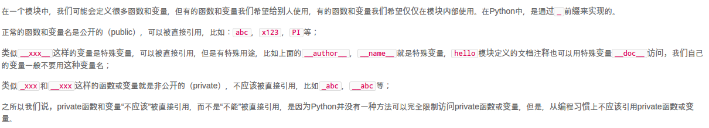

# python 自学笔记
### 变量类型
1. tuple
2. list
3. dict
4. set
5. int、float、str、boolean

### 函数参数
1. 参数缺省值：`def myFun(arge = ?)`
2. 可变参数：`def myFun(*arge)`。若已经有一个list或tuple时，要调用一个可变参数函数时，可采用如下方式：
```python
num = [1, 2, 3]
myFun(*num)
```
3. 关键字参数`def myFun(arge1, arge2, **arges)`，这表明前两个参数必需，后面其它参数可选。下面示例：
```python
def person(name, age, **kw):
    print('name:', name, 'age:', age, 'other:', kw)

>>> person('Michael', 30)
name: Michael age: 30 other: {}

>>> person('Bob', 35, city='Beijing')
name: Bob age: 35 other: {'city': 'Beijing'}
>>> person('Adam', 45, gender='M', job='Engineer')
name: Adam age: 45 other: {'gender': 'M', 'job': 'Engineer'}

>>> extra = {'city': 'Beijing', 'job': 'Engineer'}
>>> person('Jack', 24, **extra)
name: Jack age: 24 other: {'city': 'Beijing', 'job': 'Engineer'}
```
### 高级特征
1. 切片：`[a:b:c]`，a表示起始下标，b表示终点下标的前一个，c表示“步长”
2. 迭代：`for ... in`。默认下，dict迭代的是key，若要value，可以用`for value in dict.values`，若key和value都要迭代，则`for k, v in d.items()`
<br />
判断对象是否可迭代
```python
>>> from collections import Iterable
>>> isinstance('abc', Iterable) # str是否可迭代
True
>>> isinstance([1,2,3], Iterable) # list是否可迭代
True
>>> isinstance(123, Iterable) # 整数是否可迭代
False
```
3. generator: 一边循环一边计算的机制，称为生成器。**generator保存的是算法，每次调用next(g)，就计算出g的下一个元素的值，直到计算到最后一个元素**
generator创建方法：
```python
# 使用例子
def odd():
    print('step 1')
    yield 1
    print('step 2')
    yield(3)
    print('step 3')
    yield(5)
    
# 通过next()获取值
>>> o = odd()
>>> next(o)
step 1
1
>>> next(o)
step 2
3
>>> next(o)
step 3
5
>>> next(o)
Traceback (most recent call last):
  File "<stdin>", line 1, in <module>
StopIteration

# 通过迭代获取值

#!/usr/bin/env python3
# -*- coding: utf-8 -*-

def triangles():
  array = [1]
  while True:
    yield array
    temp = array
    temp.append(0)
    array = [1]
    index = 0
    while index + 1 < len(temp):
      array.append(temp[index] + temp[index + 1])
      index += 1

if __name__ == '__main__':
  n = 0
  for t in triangles():
    print(t)
    n += 1
    if n == 10:
      break
```
3. 迭代器：指能通过`for ... in`遍历的对象，包括：`list`、`tuple`、`dict`、`set`、`str`、`generator(包括生成器和yield函数)`，这些统称为`Iterable`，可通过如下方式判断：
```python
from collections import Iterable
isinstance(?, Iterable)
```
总结：**`Iterable`**类型——可作用与`for`循环的对象；
**Iterator**类型——可作用于`next()`的对象

### 函数式编程
1. 面向过程：将复杂任务分解成一个个简单的子任务，每个子任务由相应函数实现，即函数就是面向过程程序设计的基本单元
2. 函数式编程：一种面向过程的编程模式，其一个特点是，允许把函数本身作为参数传入另一个函数，还允许返回一个函数

#### 高阶函数
1. `map()`：将传入的函数依次作用到序列的每个元素，并把结果作为新的Iterator返回。<br />
`reduce()`：把一个函数作用在一个序列[x1, x2, x3, ...]上，这个函数必须接收两个参数，reduce把结果继续和序列的下一个元素做**累积计算**
```python
# map()
>>> def f(x):
...     return x * x
...
>>> r = map(f, [1, 2, 3, 4, 5, 6, 7, 8, 9])
>>> list(r)
[1, 4, 9, 16, 25, 36, 49, 64, 81]

# reduce()
>>> from functools import reduce
>>> def add(x, y):
...     return x + y
...
>>> reduce(add, [1, 3, 5, 7, 9])
25
```
2. `filter()`：接受一个函数和一个序列，把传入的函数一次作用于每个元素，然后根据返回值是`True`还是`False`来决定保留还是丢弃该元素
```py
def is_odd(n):
    return n % 2 == 1

list(filter(is_odd, [1, 2, 4, 5, 6, 9, 10, 15]))
# 结果: [1, 5, 9, 15]
```
3. `sorted()`：排序。sorted(Iterable, key=?[, reverse=True/False])
```py
>>> sorted([36, 5, -12, 9, -21])
[-21, -12, 5, 9, 36]

>>> sorted([36, 5, -12, 9, -21], key=abs)
[5, 9, -12, -21, 36]
```
4. 匿名函数：`lambda`函数
5. 闭包
6. 装饰器：Decorator，指在代码运行期间**动态增加功能**的方式。本质上，decorator是一个高阶函数。
```python
# ***** 装饰器本身无需传参时 ***** #

def log(func):
    @functools.wraps(func)
    def wrapper(*args, **kw):
        print('call %s():' % func.__name__)
        return func(*args, **kw)
    return wrapper

@log
def now():
    print('2015-3-25')

>>> now()
call now():
2015-3-25
# 由于log()是一个decorator，返回一个函数，
# 所以，原来的now()函数仍然存在，只是现在同
# 名的now变量指向了新的函数，于是调用now()
# 将执行新函数，即在log()函数中返回的wrapper()函数。

# ***** 装饰器本身需要传参时 ***** #

def log(text):
    def decorator(func):
        @functools.wraps(func)
        def wrapper(*args, **kw):
            print('%s %s():' % (text, func.__name__))
            return func(*args, **kw)
        return wrapper
    return decorator

@log('execute')
def now():
    print('2015-3-25')

>>> now()
execute now():
2015-3-25
# 首先执行log('execute')，返回的是decorator函数，再调用
# 返回的函数，参数是now函数，返回值最终是wrapper函数

'''
注意：
import functools
@functools.wraps(func)：用于把原始函数的__name__等属性复制到wrapper()函数中，否则，有些依赖函数签名的代码执行就会出错
'''
```

### 模块
1. 一个`.py`文件即为一个模块。以下为Python模块的标准文件模板：
```python
#!/usr/bin/env python3
# -*- coding: utf-8 -*-

' a test module '

__author__ = 'Michael Liao'

import sys

def test():
    args = sys.argv
    if len(args)==1:
        print('Hello, world!')
    elif len(args)==2:
        print('Hello, %s!' % args[1])
    else:
        print('Too many arguments!')

if __name__=='__main__':
    test()
```
注：第4行是一个字符串，表示模块的文档注释，任何模块代码的第一个字符串都被视为模块的文档注释；
第6行使用__author__变量把作者写进去，这样当你公开源代码后别人就可以瞻仰你的大名

2. `args = sys.argv`：获取命令行中的输入并作为list保存进args中
3. 作用域


### 面向对象编程——OOP
1. 例子：
```python
class Student(object):

    def __init__(self, name, score):
        self.name = name
        self.score = score

    def print_score(self):
        print('%s: %s' % (self.name, self.score))
# 类的创建
a = Student('chenhch8', 100)
```
注：(object)表明这个类自object类(object是基类)，注意，**每个方法的第一个参数必为`self`**

2. 访问控制：如果要让内部属性不被外部访问，可以把属性的名称前加上两个下划线`__`，在Python中，实例的变量名如果以`__`开头，就变成了一个私有变量（private），只有内部可以访问，外部不能访问
（实际上，Python解释把`__name`变成了`_Student_name`,即实际上是修改了变量名！所以其实是依旧可以 被访问到的。）
3. 继承和多态：
```python
class Animal(object):
   def run():
        print('Animal is running')

class Cat(Animal):
    def run():
        print('Cat is running')

class Dog(Animal):
    def run():
        print('Dog is running')
```
4. 获取对象信息：
    1. `type()`：返回的是对应的Class类型——``
    2. `isinstance()`：判断一个对象是否是该类本身，或者位于该类型的父继承类上
    3. `dir()`：获取一个对象所有属性和方法，它返回一个包含字符串的list
    4. `getattr(), setattr(), hasattr()`：直接操作一个对象的状态
```python
>>> class MyObject(object):
>>>     name = 'chenhch8' # 相当于c++中的’static‘，即所有实例共享一个变量
...     def __init__(self):
...         self.x = 9
...     def power(self):
...         return self.x * self.x
...
>>> obj = MyObject()
>>> hasattr(obj, 'x') # 有属性'x'吗？
True
>>> obj.x
9
>>> hasattr(obj, 'y') # 有属性'y'吗？
False
>>> setattr(obj, 'y', 19) # 设置一个属性'y'
>>> hasattr(obj, 'y') # 有属性'y'吗？
True
>>> getattr(obj, 'y', 404) # 获取属性'y'，若无'y',则返回404
19
>>> obj.y # 获取属性'y'
19
```

### 面向对象高级编程
1. 动态语言灵活性：可以给类的具体某个实例绑定任何属性和方法，但是，给一个实例绑定的方法，对另一个实例是不起作用的，故若为了给所有实例都绑定方法，可以给class绑定方法来实现
2. `__slots__`：限制实例动态添加的属性，**注意，`__slots__`定义的属性仅对当前类的实例有效，对该类继承的子类则无效**
```python
class Student(object):
    __slots__ = ('name', 'age') # 用tuple定义允许绑定的属性名称
```
3. `@property`：负责把一个方法编程属性调用
```python
class Student(object):

    @property
    def score(self):
        return self._score

    @score.setter
    def score(self, value):
        if not isinstance(value, int):
            raise ValueError('score must be an integer!')
        if value < 0 or value > 100:
            raise ValueError('score must between 0 ~ 100!')
        self._score = value

>>> s = Student()
>>> s.score = 60 # OK，实际转化为s.set_score(60)
>>> s.score # OK，实际转化为s.get_score()
60
>>> s.score = 9999
Traceback (most recent call last):
  ...
ValueError: score must between 0 ~ 100!
```
4. 多重继承：`class a(class1, class2[, ...])`
5. 定制类：
    1. `__str__()`：打印类时，如`print(Student('chenhch8'))`时，其内部就是调用类自身的`__str__()`方法，我们可重写`__str__()`方法来自定义打印内容
    2. `__iter__()`：如果一个类想被用于`for ... in`循环，类似`list`或`tuple`那样，就必须实现一个`__iter__()`方法，该方法返回一个迭代对象，然后，Python的for循环就会不断调用该迭代对象的__next__()方法拿到循环的下一个值，直到遇到`StopIteration`错误时退出循环。
    3. `__getitem__()`：令类元素能像list那样按照下标取出
    4. `__getattr__()`：当调用不存在的属性时，比如score，Python解释器会试图调用__getattr__(self, 'score')来尝试获得属性，这样，我们就有机会返回score的值。注意，只有在没有找到属性的情况下，才调用__getattr__，已有的属性，比如name，不会在__getattr__中查找
```python
class Fib(object):
    def __init__(self):
        self.a, self.b = 0, 1 # 初始化两个计数器a，b

    def __iter__(self):
        return self # 实例本身就是迭代对象，故返回自己

    def __next__(self):
        self.a, self.b = self.b, self.a + self.b # 计算下一个值
        if self.a > 100000: # 退出循环的条件
            raise StopIteration()
        return self.a # 返回下一个值

    def __getitem__(self, n):
        if isinstance(n, int): # n是索引
            a, b = 1, 1
            for x in range(n):
                a, b = b, a + b
            return a
        if isinstance(n, slice): # n是切片
            start = n.start
            stop = n.stop
            if start is None:
                start = 0
            a, b = 1, 1
            L = []
            for x in range(stop):
                if x >= start:
                    L.append(a)
                a, b = b, a + b
            return L

# 用到了__iter__()+__next__()
>>> for n in Fib():
...     print(n)
...
1
1
2
3
5
...
46368
75025

# 用到了__getitem__()的索引
>>> f = Fib()
>>> f[0]
1
>>> f[1]
1
>>> f[2]
2
>>> f[3]
3
>>> f[10]
89
>>> f[100]
573147844013817084101

# 用到了__getitem__()的切片
>>> f = Fib()
>>> f[0:5]
[1, 1, 2, 3, 5]
>>> f[:10]
[1, 1, 2, 3, 5, 8, 13, 21, 34, 55]

# **** __getattr__() **** #

class Student(object):

    def __init__(self):
        self.name = 'Michael'

    def __getattr__(self, attr):
        if attr=='score':
            return 99 # 或者返回函数，如return lambda: 25
        raise AttributeError('\'Student\' object has no attribute \'%s\'' % attr)

>>> s = Student()
>>> s.name
'Michael'
>>> s.score
99

# **** __str__() + __getattr__() **** #
# 链式调用
class Chain(object):

    def __init__(self, path=''):
        self._path = path

    def __getattr__(self, path):
        return Chain('%s/%s' % (self._path, path))

    def __str__(self):
        return self._path

    __repr__ = __str__

>>> Chain().status.user.timeline.list
'/status/user/timeline/list'
```
6. 枚举类：`Enum`
```python
from enum import Enum

Month = Enum('Month', ('Jan', 'Feb', 'Mar', 'Apr', 'May', 'Jun', 'Jul', 'Aug', 'Sep', 'Oct', 'Nov', 'Dec'))

for name, member in Month.__members__.items():
    print(name, '=>', member, ',', member.value)
```
7. **动态语言和静态语言最大的不同，就是函数和类的定义，不是编译时定义的，而是运行时动态创建的。**

### 错误、调试、测试
1. Python的错误其实也是class，所有的错误类型都继承自**BaseException**
2. `try...except...finally...`：可以跨越多层调用，如果错误没有被捕获，它就会一直往上抛，最后被Python解释器捕获，打印一个错误信息，然后程序退出
```python
try:
    print('try...')
    r = 10 / int('2')
    print('result:', r)
except ValueError as e:
    print('ValueError:', e)
except ZeroDivisionError as e:
    print('ZeroDivisionError:', e)
else: # 若没有错误则执行 else
    print('no error!')
finally: # 最后一定会被执行
    print('finally...')
print('END')
```
3. `logging`模块：出错时，会打印完错误信息后继续执行直至正常退出。同时通过配置`logging`后，还可以将错误记录到日志文件中
```python
# err_logging.py

import logging
logging.basicConfig(level=logging.INFO) # loggin 基本配置

def foo(s):
    return 10 / int(s)

def bar(s):
    return foo(s) * 2

def main():
    try:
        bar('0')
    except Exception as e:
        logging.exception(e)

main()
print('END')

$ python3 err_logging.py
ERROR:root:division by zero
Traceback (most recent call last):
  File "err_logging.py", line 13, in main
    bar('0')
  File "err_logging.py", line 9, in bar
    return foo(s) * 2
  File "err_logging.py", line 6, in foo
    return 10 / int(s)
ZeroDivisionError: division by zero
END # 打印了 END ，说明程序继续执行直至正常退出了
```
4. 错误抛出：`raise`。`raise`不带参数时，就会把当前错误抛出
```python
def foo(s):
    n = int(s)
    if n==0:
        raise ValueError('invalid value: %s' % s)
    return 10 / n

def bar():
    try:
        foo('0')
    except ValueError as e:
        print('ValueError!')
        raise
```
5. 调试
    1. 断言：`assert`——如果断言失败，assert语句本身就会抛出AssertionError
```python
# **** 断言 **** #
def foo(s):
    n = int(s)
    assert n != 0, 'n is zero!'
    return 10 / n

$ python3 err.py
Traceback (most recent call last):
  ...
AssertionError: n is zero!

# 启动Python解释器时可以用-O参数来关闭assert
$ python3 -O err.py
Traceback (most recent call last):
  ...
ZeroDivisionError: division by zero
```
6. 单元测试：`unittest`模块。以test开头的方法就是测试方法，不以test开头的方法不被认为是测试方法，测试的时候不会被执行。
```python
# mydic.py
class Dict(dict):

    def __init__(self, **kw):
        super().__init__(**kw)

    def __getattr__(self, key):
        try:
            return self[key]
        except KeyError:
            raise AttributeError(r"'Dict' object has no attribute '%s'" % key)

    def __setattr__(self, key, value):
        self[key] = value

# mydict_test.py
import unittest

from mydict import Dict

class TestDict(unittest.TestCase): # 继承unittest.TestCase

    def test_init(self):
        d = Dict(a=1, b='test')
        self.assertEqual(d.a, 1)
        self.assertEqual(d.b, 'test')
        self.assertTrue(isinstance(d, dict))

    def test_key(self):
        d = Dict()
        d['key'] = 'value'
        self.assertEqual(d.key, 'value')

    def test_attr(self):
        d = Dict()
        d.key = 'value'
        self.assertTrue('key' in d)
        self.assertEqual(d['key'], 'value')

    def test_keyerror(self):
        d = Dict()
        with self.assertRaises(KeyError):
            value = d['empty']

    def test_attrerror(self):
        d = Dict()
        with self.assertRaises(AttributeError):
            value = d.empty
    # 在每调用一个测试方法的前被执行
    def setUp(self):
        print('setUp...')
    # 在每调用一个测试方法后分别被执行
    def tearDown(self):
        print('tearDown...')
# 运行单元测试
if __name__ == '__main__':
    unittest.main()
# 或者
$ python3 -m unittest mydict_test
```

### IO编程
1. 例子：
```python
try:
    f = open('/path/to/file', 'r')
    print(f.read())
finally:
    if f:
        f.close()

# python引入了 with 语句来自动调用 close() 方法
with open('/path/to/file', 'r') as f:
    print(f.read())
```
2. `read()`：带一个可选参数，表示一次性读取多少**bytes**。若无参数，默认一次性读入全部<br />
`readline()`：一次性读入一行<br />
`readlines()`：一次读入所有内容并按照行返回`list`
```python
with open('/path/to/file', 'r') as f:
  for line in f.readlines():
    print(line.strip()) # 把末尾的'\n'删掉
```
3. `open(filename[,limit])`：`limit`有如下选项：
```
'r'：读权限
'w'：写权限
'rb'：二进制文件读权限
'wb'：二进制文件写权限
encoding='gbk'：打开gdk编码的文件

```
4. `StringIO`：在内存中读写str，操作的只能是str
```python
# 写
>>> from io import StringIO
>>> f = StringIO()
>>> f.write('hello')
5
>>> f.write(' ')
1
>>> f.write('world!')
6
>>> print(f.getvalue())
hello world!

# 读
>>> from io import StringIO
>>> f = StringIO('Hello!\nHi!\nGoodbye!')
>>> while True:
...     s = f.readline()
...     if s == '':
...         break
...     print(s.strip())
...
Hello!
Hi!
Goodbye!
```
5. `BytesIO`：在内存中读写bytes
```python
# 写
>>> from io import BytesIO
>>> f = BytesIO()
>>> f.write('中文'.encode('utf-8')) # 请注意，写入的不是str，而是经过UTF-8编码的bytes。
6
>>> print(f.getvalue())
b'\xe4\xb8\xad\xe6\x96\x87'

# 读
>>> from io import BytesIO
>>> f = BytesIO(b'\xe4\xb8\xad\xe6\x96\x87')
>>> f.read()
b'\xe4\xb8\xad\xe6\x96\x87'
```
6. 操作文件和目录：`os`模块
```python
# 查看当前目录的绝对路径:
>>> os.path.abspath('.')
'/Users/michael'
# 拼接路径名:
>>> os.path.join('/Users/michael', 'testdir')
'/Users/michael/testdir'
# 然后创建一个目录:
>>> os.mkdir('/Users/michael/testdir')
# 删掉一个目录:
>>> os.rmdir('/Users/michael/testdir')
# 拆分路径名
>>> os.path.split('/Users/michael/testdir/file.txt')
('/Users/michael/testdir', 'file.txt')
# 获取文件扩展名
>>> os.path.splitext('/path/to/file.txt')
('/path/to/file', '.txt')
# 对文件重命名:
>>> os.rename('test.txt', 'test.py')
# 删掉文件:
>>> os.remove('test.py')
# 列出当前目录下的所有目录
>>> [x for x in os.listdir('.') if os.path.isdir(x)]
['.lein', '.local', '.m2', '.npm', '.ssh', '.Trash', '.vim', 'Applications', 'Desktop', ...]
# 列出当前目录下所有.py文件
>>> [x for x in os.listdir('.') if os.path.isfile(x) and os.path.splitext(x)[1]=='.py']
['apis.py', 'config.py', 'models.py', 'pymonitor.py', 'test_db.py', 'urls.py', 'wsgiapp.py']
```
